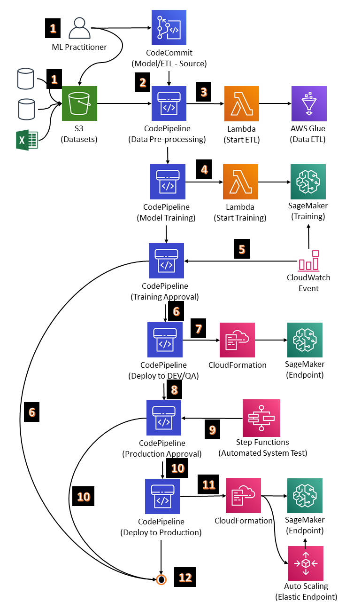
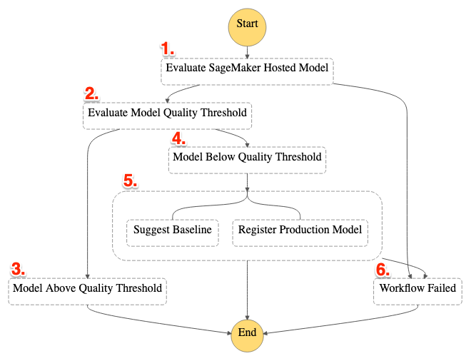
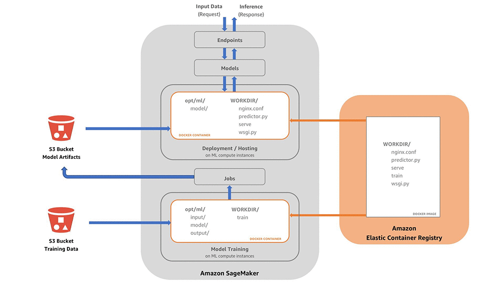
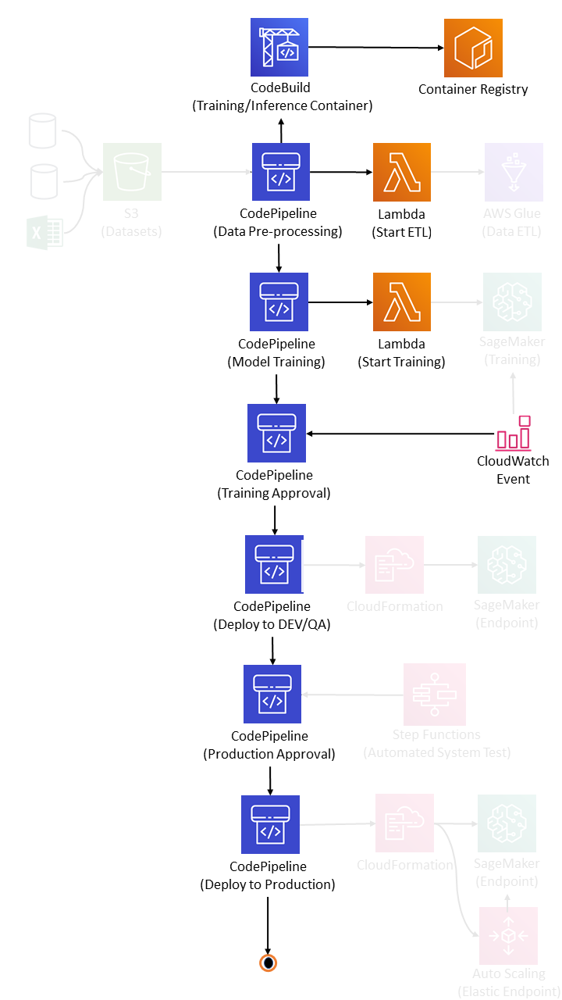

# Abalone MLOps Pipeline

## Introduction
Welcome to the Abalone MLOps Pipeline project, undertaken by Acme Data Solutions Inc. In collaboration with **Acme Marine Research**, we've embarked on an exciting journey to solve the Abalone problem.

## The Abalone Problem

**Abalones**, a type of marine mollusk, have intrigued marine biologists and data scientists alike due to their complex growth patterns. Understanding an abalone's age from physical measurements is not only a fascinating scientific problem but also holds practical significance in various fields such as marine conservation and aquaculture.

**Acme Data Solutions Inc.** is a pioneering data and AI consultancy, specializing in cutting-edge solutions for businesses and research institutions. With a track record of successfully delivering AI and machine learning projects, we have been entrusted by Acme Marine Research to create an efficient and scalable solution to the Abalone problem.

## Our Mission
Our mission is to build an end-to-end Machine Learning Operations (MLOps) pipeline using AWS services that will:
- **Automate** data collection and preprocessing.
- **Train and deploy** machine learning models for abalone age estimation.
- **Monitor** model performance and retrain as needed.

## Architecture



### AWS Services Used
This project utilizes several AWS services to create an end-to-end MLOps pipeline:
- **Amazon S3:** Object storage for data and artifacts.
- **AWS CodeCommit:** Version control for your code.
- **AWS CodePipeline:** Continuous integration and continuous delivery (CI/CD) service.
- **AWS Lambda:** Serverless compute service for event-driven tasks.
- **AWS Glue:** ETL (Extract, Transform, Load) service.
- **Amazon SageMaker:** Managed machine learning service.
- **Amazon CloudWatch:** Monitoring and logging service.
- **AWS CloudFormation:** Infrastructure as Code (IaC) service.
- **AWS Step Functions:** Serverless orchestration service.

The pipeline works as follows:

1. **Code** changes are pushed to the CodeCommit repository.
1. **CodePipeline** triggers a build when it detects a change in the1. CodeCommit repository.
1. **CodePipeline** builds the application code and runs unit tests.
1. **CodePipeline** deploys the application to a development environment.
1. **A Lambda function** is triggered to start the ETL process.
1. **AWS Glue performs** the ETL process to prepare and load the data for ML.
1. **CodePipeline** triggers a training job when it detects that the data is ready.
1. **SageMaker** trains the ML model.
1. **CodePipeline** deploys the trained ML model to a staging environment.
1. **Step Functions** runs an automated system test to validate the ML model.
1. **CodePipeline** deploys the ML model to production when the automated system test is successful.
1. **CloudWatch** monitors the performance of the ML model in production.

## Getting Started
To get started with this project, follow these steps:

### Prerequisites
- [Install Terraform](https://www.terraform.io/downloads.html)
- Set up a free-tier AWS account: [AWS Free Tier](https://aws.amazon.com/free/)

## Project structure

This section provides an overview of the project's directory structure, highlighting key folders and their associated artifacts.

### `data`

- **Description:** This directory contains data-related assets, including images and raw datasets.
- **Contents:**
  - `images`: A subdirectory housing various images used in documentation and visualization.
  - `raw`: A subdirectory containing raw data files used for training and processing.

### `docs`

- **Description:** The `docs` folder is reserved for documentation files, which may include project guides, manuals, or reference materials. Currently, this project does not include specific documentation files.

### `infrastructure`

- **Description:** The `infrastructure` directory holds Terraform configurations for provisioning cloud resources, such as AWS services.
- **Contents:**
  - `terraform`: Subdirectory containing Terraform configuration files for different AWS services.
    - `cloud9`: Configuration for AWS Cloud9, an integrated development environment (IDE).
    - `code-commit`: Configuration for AWS CodeCommit, a version control service.
    - `code-pipeline`: Configuration for AWS CodePipeline, a CI/CD service.
    - `ecr`: Configuration for Amazon Elastic Container Registry (ECR), used for container image management.
    - `iam`: Configuration for AWS Identity and Access Management (IAM) roles and policies.
    - `s3`: Configuration for Amazon S3 buckets.

### `src`

- **Description:** The `src` directory contains the source code and scripts for various project components.
- **Contents:**
  - `cli`: Scripts and utilities for command-line interactions and setup.
  - `etl`: Extract, Transform, Load (ETL) job configurations and scripts.
  - `model`: Source code and resources for machine learning models.
  - `pipeline`: Configuration and scripts for defining the project's CI/CD pipeline.
  - `tests`: Unit and system test scripts.
  - `utils`: Utility scripts for tasks such as resizing Cloud9 instances and repository validation.


```
├── data
│   ├── images
│   │   ├── architecture.png
│   │   ├── pipeline-execution.png
│   │   ├── system-train-assets.png
│   │   └── training-assets.png
│   └── raw
│       └── abalone.csv
├── docs
├── infrastructure
│   └── terraform
│       ├── cloud9
│       │   ├── main.tf
│       │   ├── outputs.tf
│       │   └── variables.tf
│       ├── code-commit
│       │   ├── main.tf
│       │   └── outputs.tf
│       ├── code-pipeline
│       │   ├── main.tf
│       │   ├── outputs.tf
│       │   └── variables.tf
│       ├── ecr
│       │   ├── main.tf
│       │   └── outputs.tf
│       ├── iam
│       │   ├── main.tf
│       │   ├── outputs.tf
│       │   └── variables.tf
│       ├── main.tf
│       ├── outputs.tf
│       └── s3
│           ├── main.tf
│           ├── outputs.tf
│           └── variables.tf
├── LICENSE
├── README.md
└── src
    ├── cli
    │   ├── assets
    │   │   ├── config-push-assets.sh
    │   │   └── config-push-training-assets.sh
    │   ├── cloud9
    │   │   ├── resize-c9.sh
    │   │   ├── setup-cli-cloud9.sh
    │   │   ├── setup-cloud9.sh
    │   │   └── variables.sh
    │   ├── code-commit
    │   │   └── clone-repo.sh
    │   ├── ecr
    │   ├── pipeline
    │   │   └── create-pipeline.sh
    │   ├── s3
    │   │   └── create-s3-bucket.sh
    │   ├── test-assets
    │   │   └── test.sh
    │   ├── unit-tests
    │   │   └── perform-tests
    │   └── validation.sh
    ├── etl
    │   ├── etljob.json
    │   └── preprocess.py
    ├── model
    │   ├── app.py
    │   ├── assets
    │   │   ├── Dev
    │   │   │   ├── deploy-model-Dev.yml
    │   │   │   └── Dev-config.json
    │   │   └── Prd
    │   │       ├── deploy-model-Prd.yml
    │   │       └── Prd-config.json
    │   ├── build.py
    │   ├── buildspec.yml
    │   ├── Dockerfile
    │   ├── model.py
    │   ├── nginx.conf
    │   ├── trainingjob.json
    │   └── wsgi.py
    ├── pipeline
    │   ├── EtlJobMonitor
    │   │   └── lambda.py
    │   ├── EtlLaunchJob
    │   │   └── lambda.py
    │   ├── mlops-pipeline.yml
    │   ├── ModelGroup
    │   │   └── lambda.py
    │   ├── TrainingJobMonitor
    │   │   └── lambda.py
    │   └── TrainingLaunchJob
    │       └── lambda.py
    ├── tests
    │   ├── system_test
    │   │   ├── assets
    │   │   │   ├── evaluateEndpoint
    │   │   │   │   └── lambda.py
    │   │   │   ├── registerModel
    │   │   │   │   └── lambda.py
    │   │   │   ├── requirements.txt
    │   │   │   └── workflow-resources.yml
    │   │   ├── build.py
    │   │   └── buildspec.yml
    │   └── unit_test
    │       ├── app_test.py
    │       └── input
    │           ├── config
    │           │   └── hyperparameters.json
    │           └── data
    │               └── training
    │                   ├── train.csv
    │                   └── validate.csv
    └── utils
        ├── c9_resize.sh
        ├── load_sim.py
        └── repository_validation.py
```

### Installation
1. Clone this repository:
```
git clone https://github.com/Pedro-A-D-S/abalone-mlops-pipeline.git

cd mlops-aws-pipeline
```

2. Navigate to the CLI folder:
```
cd src/cli
```
3. Run the setup script to provision the infrastructure on cloud9:
```
./setup-cloud9.sh
```

## System Train Assets

The **System Train Assets** are fundamental components within our Abalone MLOps Pipeline, responsible for shaping the infrastructure and configurations essential for successful machine learning model training. This set of assets encompasses the vital groundwork, including infrastructure settings, data preprocessing routines, and training job configurations. They serve as the infrastructure and preparatory layer, ensuring that the environment is suitably configured and the dataset is properly prepared for subsequent model training phases.



## Training Assets

The **Training Assets** constitute the core of our Abalone MLOps Pipeline, where the alchemy of machine learning model development unfolds. This ensemble includes the machine learning model's source code, architectural blueprints, hyperparameter definitions, and data inputs, all harmoniously arranged to cultivate and refine our models. These assets are the epicenter of our data science journey, guiding the model's growth, evaluation, and enhancement. Within these assets reside the expertise and artistry necessary to construct precise models capable of estimating abalone ages with precision.


## Pipeline Execution
After you've set everything up using the AWS Cloud9 service, this is going to be the pipeline execution:



## Configuration
This project is configured to work with AWS's free-tier resources. You may need to configure your AWS credentials and region before running any scripts.

## Contributing
If you'd like to contribute to this project, please follow these steps:
1. Fork the repository.
2. Create a new branch for your feature or bug fix: `git checkout -b feature/my-feature`.
3. Make your changes and commit them: `git commit -m "Add new feature"`.
4. Push your branch to your fork: `git push origin feature/my-feature`.
5. Open a pull request on the original repository.

## License
This project is licensed under the [GNU General Public License v3.0](LICENSE).

## Resources
- [AWS Documentation](https://docs.aws.amazon.com/)
- [Terraform Documentation](https://www.terraform.io/docs/index.html)

